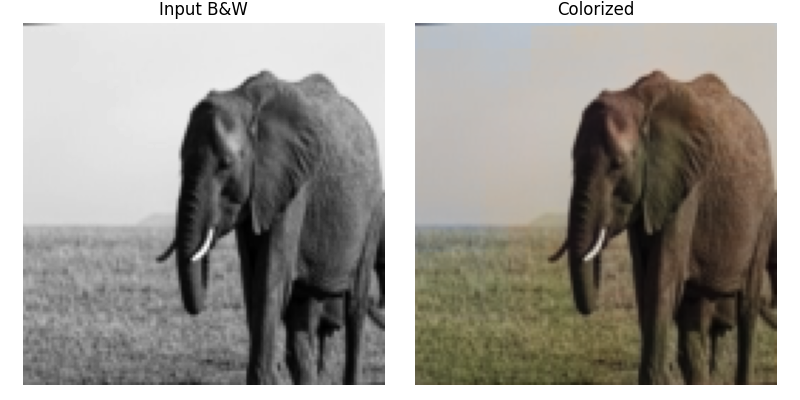

# Deep Learning for Image Colorization

### Overview
This project explores using deep learning—specifically, convolutional neural networks (CNNs)—to automatically add color to black-and-white (B/W) images. Effective colorization can help restore archival media, bring visual appeal to old photos, and enhance various artistic applications. The pipeline is designed for scalable, high-resolution colorization, with example experiments on 128x128 images.



### Problem Statement
Colorizing B/W images is a complex and ambiguous task since a grayscale image discards essential color information. The goal is to predict plausible color (chrominance) channels from gray-scale images, making inferences about real-world semantics using visual patterns.

### Methodology
Working in LAB Color Space
While images are typically stored in RGB (Red, Green, Blue), for colorization tasks it’s common to use the LAB color space:

L (Lightness): The grayscale "intensity" channel, what you see in a B/W photo.

A: Green-Red chrominance channel.

B: Blue-Yellow chrominance channel.

Using LAB allows the model to focus solely on predicting the "A" and "B" (color) components, treating the L channel as input (i.e., the grayscale image).

### Converting RGB to LAB
Conversion during preprocessing is performed using libraries such as OpenCV or skimage:

```python
import cv2
lab = cv2.cvtColor(rgb_image, cv2.COLOR_RGB2LAB)
l_channel = lab[:,:,0]
a_channel = lab[:,:,1]
b_channel = lab[:,:,2]

```

For this project, the neural network uses the L channel as input and is trained to predict the corresponding AB channels (often scaled to -1 to 1 or 0 to 1).

### Model Architecture

A deep CNN encoder-decoder is employed for this task:

- Encoder: Stacks of convolution + pooling layers contract the image spatially, learning hierarchical features.

- Decoder: Stacks of upsampling + convolution layers reconstruct full-resolution AB channels from mid-level features.

- No classes are predicted: the network learns direct mapping from grayscale input to color output.

- (Optional) Skip connections, as in U-Net, can be added to further boost detail retention.

The model can be trained at any resolution (e.g., 128x128), and is robust to input size if properly designed.

### Training

- Dataset: Dataset: 130k Images (128x128) - Universal Image Embeddings  (https://www.kaggle.com/datasets/rhtsingh/google-universal-image-embeddings-128x128/data)

- Input: Grayscale (L channel) version of each image.

- Target: True color (AB channels or RGB) version of the same image.

-  Loss: Mean squared error (MSE) between predicted and ground truth color channels.

- Device: Training on Colab L4 GPU

- Training progresses for several epochs (~20 recommended), optimizing the model's ability to "hallucinate" realistic colors.

### How Colorization Can Help

- Restoring historical photographs.

- Improving visual interest in scientific or medical imaging.

- Creating new art from old archives or films.

- Aiding AI in downstream understanding tasks for unlabelled monochrome data.

All the results are under output folder
