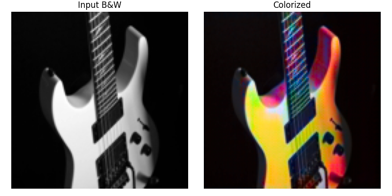
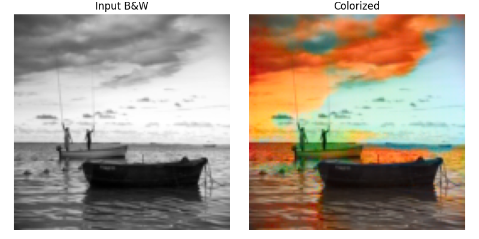

# Deep Learning for Image Colorization

### Overview

This project explores using deep learning—specifically, convolutional neural networks (CNNs) and generative adversarial networks (GANs)—to automatically add color to black-and-white (B/W) images. Effective colorization can help restore archival media, bring visual appeal to old photos, and enhance various artistic applications. The pipeline is designed for scalable, high-resolution colorization, with example experiments on 128x128 images.


### Problem Statement
Colorizing B/W images is a complex and ambiguous task since a grayscale image discards essential color information. The goal is to predict plausible color (chrominance) channels from gray-scale images, making inferences about real-world semantics using visual patterns.

### Methodology
Working in LAB Color Space
While images are typically stored in RGB (Red, Green, Blue), for colorization tasks it’s common to use the LAB color space:

**L (Lightness):** The grayscale "intensity" channel, what you see in a B/W photo.

**A:** Green-Red chrominance channel.

**B:** Blue-Yellow chrominance channel.

Using LAB allows the model to focus solely on predicting the "A" and "B" (color) components, treating the L channel as input (i.e., the grayscale image).

### Converting RGB to LAB
Conversion during preprocessing is performed using libraries such as OpenCV or skimage:

```python
import cv2
lab = cv2.cvtColor(rgb_image, cv2.COLOR_RGB2LAB)
l_channel = lab[:,:,0]
a_channel = lab[:,:,1]
b_channel = lab[:,:,2]

```

For this project, the neural network uses the L channel as input and is trained to predict the corresponding AB channels (often scaled to -1 to 1 or 0 to 1).

### Model Architecture

#### 1. CNN-Based Colorization
File : colourization_using_cnn.ipynb

A deep encoder-decoder CNN architecture is used:

- **Encoder:** Stacks of convolution + pooling layers extract hierarchical features.

- **Decoder:** Upsampling + convolution layers reconstruct the AB channels.

- Optionally, skip connections (U-Net style) help preserve spatial details.

- Trained with Mean Squared Error (MSE) loss between predicted and true AB channels.

#### 2. GAN-Based Colorization
File: colourization_using_gans.ipynb

A conditional GAN (cGAN) setup is implemented, inspired by Pix2Pix:

- **Generator**:** A U-Net that takes grayscale L-channel as input and generates AB channels.

- **Discriminator:** A PatchGAN that classifies whether a pair (L, AB) is real or generated.

- **Loss Functions:**

    - Generator: Adversarial loss + L1 loss

    - Discriminator: Binary cross-entropy

- The GAN improves the sharpness and realism of generated colors compared to the CNN.


### Training

- **Dataset:** Dataset: 130k Images (128x128) - Universal Image Embeddings  (https://www.kaggle.com/datasets/rhtsingh/google-universal-image-embeddings-128x128/data)

- **Input:** Grayscale (L channel) version of each image.

- **Target**:** True color (AB channels or RGB) version of the same image.

- **Loss:** Mean squared error (MSE) between predicted and ground truth color channels.

- **Device:** Training on Colab L4 GPU for CNN and A100 for GANs

- Training progresses for several epochs (~20 recommended), optimizing the model's ability to "hallucinate" realistic colors.

### How Colorization Can Help

- Restoring historical photographs.

- Improving visual interest in scientific or medical imaging.

- Creating new art from old archives or films.

- Aiding AI in downstream understanding tasks for unlabelled monochrome data.

### Output
All results are saved in the output/ folder including:

- CNN predictions (/output_cnn)

- GAN-based results (/output_gan)

- Grayscale inputs for comparison (/bw_img)
 
### Results
Below is a qualitative comparison between CNN and GAN-based colorization results.

| **CNN Output**| 	**GAN Output**| 
|----------|----------|
| | |
| | |
| | |
| | |
| | |


### Observations:

- The CNN model produces stable and natural-looking colors but often desaturated or conservative.

- The GAN model generates vibrant and visually appealing outputs but sometimes with inaccurate or unrealistic colors due to training instability and mode collapse.

- GANs excel in visual diversity but require careful tuning and regularization.

### Batch Colorization Script

To convert all grayscale (black-and-white) images from the /bw_img folder into color images using your trained models, two Python scripts have been added:

- colour_cnn.py – uses the CNN-based model

- colour_gan.py – uses the GAN-based model

Input folder: All grayscale images should be placed in the /bw_img/ directory.

Output folder: The colorized images will be saved in the respective output folder defined in the script.

Run ```python3 colour_cnn.py``` or ```python3 colour_gan.py``` in your terminal.

### Future Work
#### 1. Diffusion-Based Colorization
Explore diffusion models for high-quality, probabilistic color generation:

- Example: Denoising Diffusion Probabilistic Models (DDPMs)

- More stable and better color diversity than GANs

- Potential integration with conditioning on class labels or prompts

#### 2. Compare with Pretrained Models (e.g., DeOldify)

Use pretrained state-of-the-art models for benchmarking and high-fidelity results.

- DeOldify: NoGAN-based model trained on millions of images.

- GitHub: https://github.com/jantic/DeOldify

These directions can help build an even more robust and realistic colorization pipeline.
